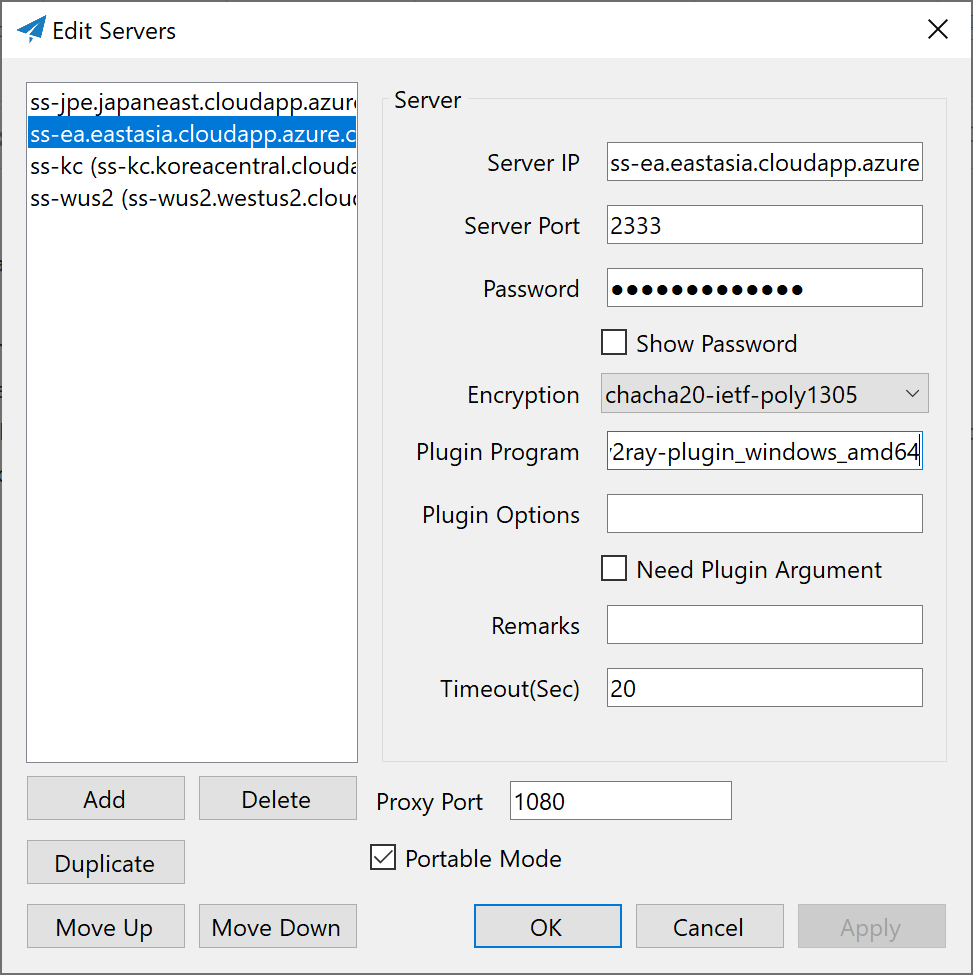

# shadowsocks-libev + plugin

This task will install shadowsocks-libev on the remote server.

## shadowsocks-libev

Update variable under file `group_vars/all/shadowsocks-libev.yml`. The least needed to change is `server_port` and `password`.

```yml
server_port: 8388
password: mypassword
```

## Plugin

### v2ray

Currently only websocket (HTTP) is supported.

## Installation

```bash
ansible-playbook site.yml -i hosts --tags "shadowsocks-libev"
```

## Output

Client-side sample config will be put under `output/shadowsocks-libev/config.json` just FYI.

## Client

Client-side installation is not included in this role. Here are just some tips.

### Windows

Download [shadowsocks-windows](https://github.com/shadowsocks/shadowsocks-windows/releases) and [v2ray-plugin](https://github.com/shadowsocks/v2ray-plugin/releases).

Put extracted binary files `Shadowsocks.exe` and `v2ray-plugin_windows_amd64.exe` together.



### Android

It is recommended to install [shadowsocks](https://play.google.com/store/apps/details?id=com.github.shadowsocks) and [v2ray plugin](https://play.google.com/store/apps/details?id=com.github.shadowsocks.plugin.v2ray) through play store.

## Useful links

* [shadowsocks-libev](https://github.com/shadowsocks/shadowsocks-libev)
* [v2ray-plugin](https://github.com/shadowsocks/v2ray-plugin)
* [ShadowsocksBio](https://github.com/JadaGates/ShadowsocksBio)
